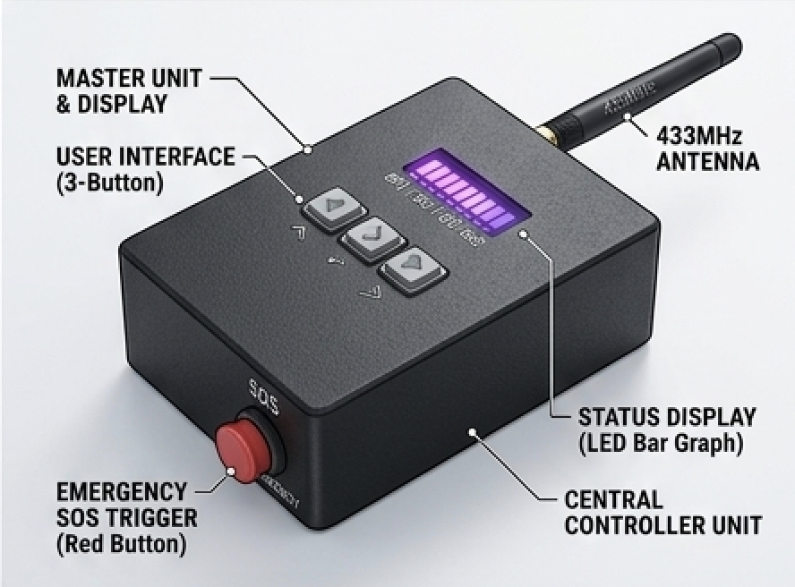
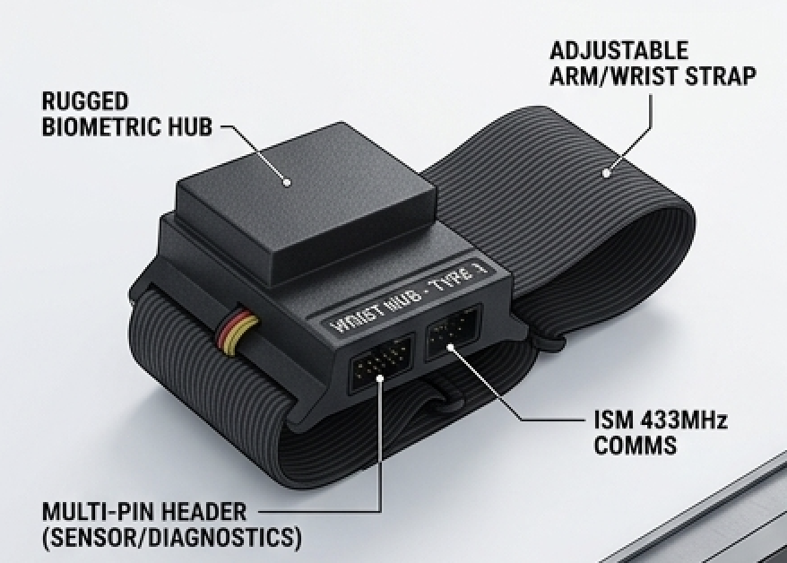
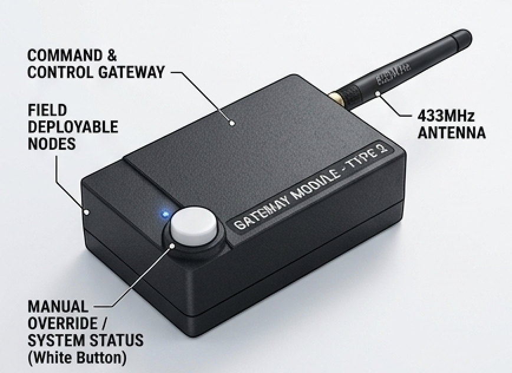
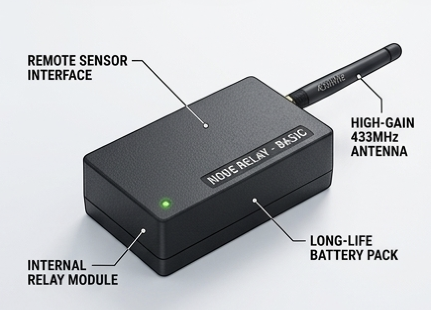
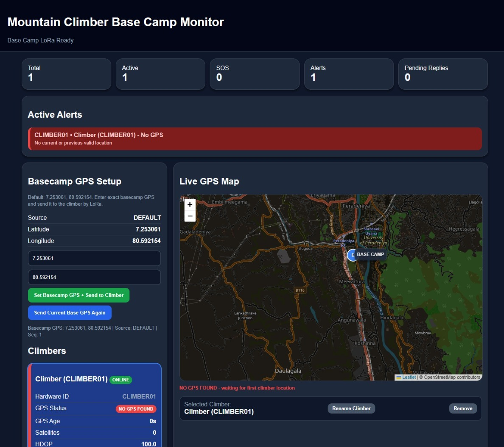
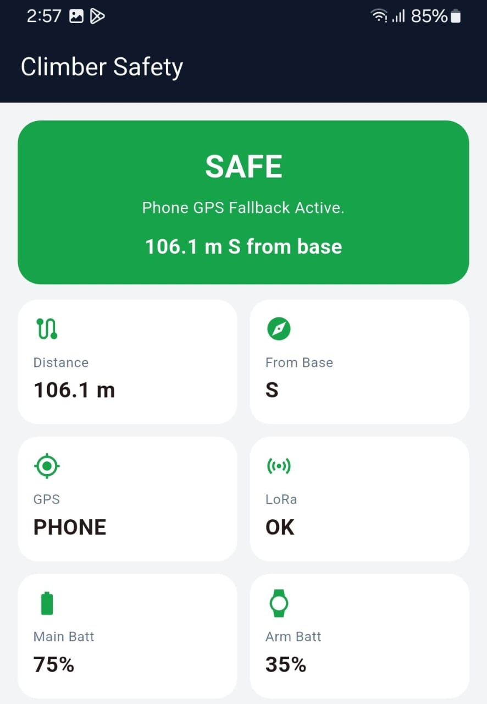
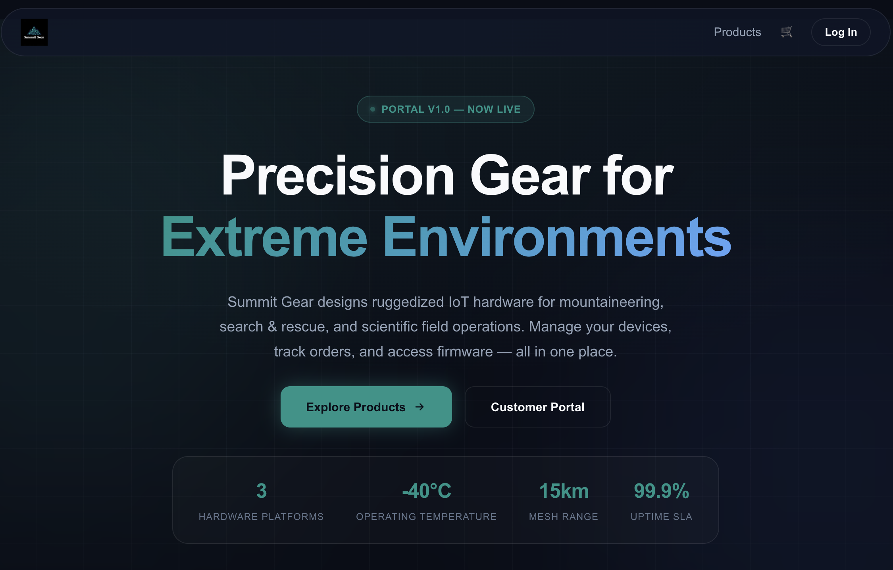

<!DOCTYPE html>
<html lang="en">
<head>
  <meta charset="UTF-8">
  <meta name="viewport" content="width=device-width, initial-scale=1.0">
  <title>Mountain Climber IoT Safety Tracking System</title>
  
  <!-- Custom CSS -->
  <link rel="stylesheet" href="./assets/css/summit-glass.css">
  
  <!-- Phosphor Icons -->
  
</head>
<body>

  <!-- HERO SECTION -->
  <header class="hero">
    <h1 class="gradient-text">Summit Tracker</h1>
    
An off-grid IoT-based safety tracking, health monitoring, and emergency communication system for mountain climbers and basecamp rescue teams.

    
    

      
      
      
    

    

      <a href="https://youtu.be/YOUR_VIDEO_ID" target="_blank" class="btn btn-primary">
        <i class="ph ph-play-circle"></i> Watch Demo
      </a>
      <a href="https://summit-gear-portal.vercel.app" target="_blank" class="btn btn-secondary">
        <i class="ph ph-shopping-cart"></i> Commercial Portal
      </a>
    

  </header>

  <!-- ARCHITECTURE DIAGRAM -->
  <section class="section">
    

      <h2 class="section-title">System Architecture</h2>
      
How data flows from the climber's wrist to the basecamp dashboard entirely off-grid.

      
      

        <h3 style="color: var(--teal); margin-bottom: 20px;">
          <i class="ph ph-watch"></i> Wristband (BLE) → <i class="ph ph-device-mobile"></i> Mobile App (WiFi) → <i class="ph ph-cpu"></i> Climber ESP32 (LoRa) → <i class="ph ph-broadcast"></i> Repeater (LoRa) → <i class="ph ph-desktop"></i> Basecamp Dashboard
        </h3>
        
The system relies on a 433MHz LoRa mesh network for 15km+ range, entirely bypassing expensive satellite networks or unavailable cellular coverage.

      

    

  </section>

  <!-- FEATURES -->
  <section class="section">
    

      <h2 class="section-title">Core Features</h2>
      
Engineered for extreme environments with zero subscription costs.

      
      

        

          <h3><i class="ph ph-crosshair" style="color: var(--teal)"></i> Smart GPS Filtering</h3>
          
Rejects GPS jitter, teleport jumps, and low-satellite anomalies. If hardware GPS fails, the mobile phone's GPS acts as an automatic fallback.

        

        

          <h3><i class="ph ph-warning" style="color: var(--coral)"></i> Accelerated SOS</h3>
          
When the physical panic button is pressed, telemetry jumps to 1-second intervals with maximum transmission priority and LBT retry logic.

        

        

          <h3><i class="ph ph-heartbeat" style="color: var(--teal)"></i> Vitals Monitoring</h3>
          
Continuous heart rate and sensor-attachment monitoring via a custom ESP32-H2 BLE wearable, relayed to basecamp.

        

        

          <h3><i class="ph ph-chat-text" style="color: var(--coral)"></i> Two-Way Messaging</h3>
          
Send and receive critical text messages between basecamp and the mobile app via the LoRa hardware bridge.

        

        

          <h3><i class="ph ph-network" style="color: var(--teal)"></i> Mesh Networking</h3>
          
Autonomous repeater nodes extend signal over mountain ridges using smart TTL-limited multi-hop routing.

        

        

          <h3><i class="ph ph-shield-check" style="color: var(--coral)"></i> Commercial Backend</h3>
          
Full e-commerce portal (Next.js & Supabase) for device purchasing, registration, and secure OTA firmware distribution.

        

      

    

  </section>

  <!-- HARDWARE COMPONENTS -->
  <section class="section">
    

      <h2 class="section-title">Hardware Stack</h2>
      
      

        

          
          <h3>Climber Main Device</h3>
          
ESP32 + SX1278 LoRa + NEO-6M GPS. Worn on the backpack, acts as the central hub.

        

        

          
          <h3>Health Wristband</h3>
          
ESP32-H2 + MAX30102. Relays heart rate over BLE to the mobile app.

        

        

          
          <h3>LoRa Repeater</h3>
          
Autonomous mesh node that re-transmits packets to extend range over ridges.

        

        

          
          <h3>Basecamp Receiver</h3>
          
USB-serial bridge linking the LoRa network directly to the rescue coordinator's laptop.

        

      

    

  </section>

  <!-- SCREENSHOTS -->
  <section class="section">
    

      <h2 class="section-title">Software Suite</h2>
      
Fully integrated from the mountain to the cloud.

      
      <h3 style="color: var(--teal); margin-bottom: 10px;">Basecamp Dashboard (Flask + Leaflet)</h3>
      

        
      

      <h3 style="color: var(--coral); margin-bottom: 10px;">Climber Mobile App (Flutter)</h3>
      

        
      

      <h3 style="color: var(--teal); margin-bottom: 10px;">Summit Gear Portal (Next.js + Supabase)</h3>
      

        
      

    

  </section>

  <!-- TEAM & SUPERVISION -->
  <section class="section" style="border-bottom: none;">
    

      <h2 class="section-title">The Team</h2>
      
Group 23 • CO328 / 3YP • Dept. of Computer Engineering, UoP

      
      

        

          
👨‍💻

          <h3 class="team-name">Sahan Jayasundara</h3>
          
E/21/198

          

            <a href="https://github.com/#"><i class="ph ph-github-logo"></i></a>
            <a href="https://linkedin.com/in/#"><i class="ph ph-linkedin-logo"></i></a>
          

        

        

          
👨‍💻

          <h3 class="team-name">Prabash Rathnayaka</h3>
          
E/21/328

          

            <a href="https://github.com/prabashmalhara"><i class="ph ph-github-logo"></i></a>
            <a href="https://linkedin.com/in/#"><i class="ph ph-linkedin-logo"></i></a>
          

        

        

          
👨‍💻

          <h3 class="team-name">Pasan Sandeep</h3>
          
E/21/353

          

            <a href="https://github.com/#"><i class="ph ph-github-logo"></i></a>
            <a href="https://linkedin.com/in/#"><i class="ph ph-linkedin-logo"></i></a>
          

        

      

      

        <h3 style="color: var(--teal); margin-bottom: 10px;">Academic Supervision</h3>
        

          Ms. Yashodha Vimukthi 
          Mr. Thiliru Samaradiwakara
        

      

    

  </section>

</body>
</html>